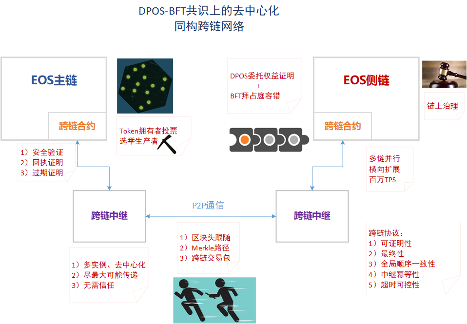
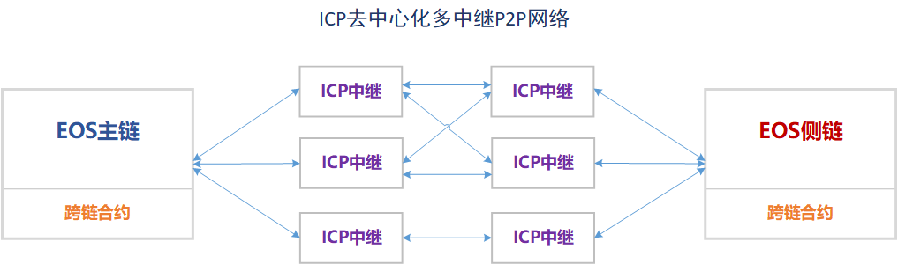

# Inter Chain Protocol (ICP)

## ICP Overview

建立于EOSIO软件堆栈之上的ICP跨链基础设施，可应用于EOSIO兼容的同构区块链的跨链通信。ICP设计之初，就考虑怎样以一种无侵入、可安全验证、去中心化的方式来实现EOS多链并行的同构跨链网络。经过对业界最前沿的跨链技术的研究（包括BTC Relay、Cosmos、Polkadot等），并结合对EOSIO软件实现细节的差异化剖析，ICP采取了比较现实的跨链方案：
- 实现类似于轻节点的跨链基础合约，对对端区块链进行区块头跟随和验证，使用Merkle树根和路径验证跨链交易的真实性，依赖全局一致的顺序来保证跨链交易同时遵循两条链的共识。
- 实现无需信任、去中心化的跨链中继，尽最大可能地向对端传递区块头和跨链交易，并对丢失、重复、超时、伪造的跨链消息进行合适的处理。



## ICP Relay

ICP中继作为nodeos的插件，可随nodeos节点部署。部署模式上有几点需要说明：
- 不需要每个nodeos都开启ICP中继插件。
- 尽量多的nodeos开启ICP中继插件，将有助于保证跨链中继工作的不中断。
- 如果所有中继均瘫痪，将中断后续跨链交易进行，但不会影响已经发生的跨链交易；中继恢复后，将造成中断期某些跨链交易超时，但不会影响后续跨链交易的安全验证（这类似于所有nodeos节点瘫痪也会造成EOS区块链暂停）。
- 本端ICP中继可以连接对端多个ICP中继。
- 本端开启了ICP中继的nodeos之间可链内P2P互连(net_plugin/bnet_plugin)，但不可ICP P2P互连(icp_relay_plugin)。
- 本端ICP中继插件负责向本端跨链合约查询或发送交易，但不能直接向对端跨链合约查询或发送交易，而只能借助于与对端ICP中继的P2P通信。



## ICP Network

基于EOSIO的两条同构区块链，需**对称**部署**一对**跨链中继和跨链合约。那么要达成多条区块链之间的ICP跨链通信，可在每两条链之间都这样部署。其实，从ICP基础设施的角度来说，ICP只负责**两条**区块链之间的跨链通信。如果要建立无感知的平滑跨越数条区块链的跨链通信网络，可在ICP基础合约之上编写合约构建**跨链网络协议(Inter Chain Network Protocol)**。


## ICP Components

#### ICP Relay Plugin

- [ICP Relay Plugin](https://github.com/eoscochain/eoscochain/tree/master/plugins/icp_relay_plugin)
- [ICP Relay API Plugin](https://github.com/eoscochain/eoscochain/tree/master/plugins/icp_relay_api_plugin)

#### ICP Contract

- [ICP Contract](https://github.com/eoscochain/eoscochain/tree/master/contracts/icp)

#### ICP Token Contract

- [ICP Token Contract](https://github.com/eoscochain/eoscochain/tree/master/contracts/icp.token): 跨链资产转移合约，是跨链交易的典型应用示例。

## ICP Testnet Setup

目前ICP依然处于测试状态，不可用于生产环境。这里给出搭建ICP测试网的步骤。

#### 编译安装EOS Cochain

EOS Cochain默认集成了ICP组件，可以方便您快速搭建和测试ICP。

**注意**：ICP并不需要针对EOSIO做太多定制，几乎仅将ICP跨链合约和跨链中继插件编译到EOSIO软件中即可启用ICP。

#### 启动两条测试链

在本地同时启动两条测试链，需要为他们新建各自的工作目录：
```Bash
mkdir ~/chain1
mkdir ~/chain2
```

预启动测试链，生成创世区块：
```Bash
nodeos --config-dir /root/chain1/config --data-dir /root/chain1/data
nodeos --config-dir /root/chain2/config --data-dir /root/chain2/data
```


退出nodeos，编辑生成的config.ini中的相关配置项。
```INI
# Override default WASM runtime (eosio::chain_plugin)
wasm-runtime = wabt

# print contract's output to console (eosio::chain_plugin)
# 方便观察跨链合约打印信息
contracts-console = true

# The local IP and port to listen for incoming http connections; set blank to disable. (eosio::http_plugin)
# 链1为127.0.0.1:8888，链2为127.0.0.1:8889
http-server-address = 127.0.0.1:8888 # 或 127.0.0.1:8889

# The endpoint upon which to listen for incoming connections (eosio::icp_relay_plugin)
# 链1为0.0.0.0:8765，链2为0.0.0.0:8766
icp-relay-endpoint = 0.0.0.0:8765 # 或 0.0.0.0:8766

# The number of threads to use to process network messages (eosio::icp_relay_plugin)
# icp-relay-threads = 

# Remote endpoint of other node to connect to (may specify multiple times) (eosio::icp_relay_plugin)
# 链1为127.0.0.1:8766，链2为127.0.0.1:8765；其实只要填一个，使得两条链的ICP插件能够连接上
# icp-relay-connect = 127.0.0.1:8766 # 或 127.0.0.1:8765

# The chain id of icp peer (eosio::icp_relay_plugin)
# 链1填写链2的chain id，链2填写链1的chain id，可参考后文获取方式后再填写
icp-relay-peer-chain-id = 630f427c3007b42929032bc02e5d6fded325b3e2caf592f963070381b2787a9d

# The peer icp contract account name (eosio::icp_relay_plugin)
# 对端ICP合约账户名；链1填写链2上跨链合约账户名，链2填写链1上跨链合约账户名
icp-relay-peer-contract = cochainioicp

# The local icp contract account name (eosio::icp_relay_plugin)
# 本端ICP合约账户名；链1填写链1上跨链合约账户名，链2填写链2上跨链合约账户名
icp-relay-local-contract = cochainioicp

# The account and permission level to authorize icp transactions on local icp contract, as in 'account@permission' (eosio::icp_relay_plugin)
# ICP插件向本端ICP合约发送交易时使用的账户名
icp-relay-signer = cochainrelay@active

# The actual host:port used to listen for incoming p2p connections. (eosio::net_plugin)
# 链1为0.0.0.0:9876，链2为0.0.0.0:9877
p2p-listen-endpoint = 0.0.0.0:9876 # 或 0.0.0.0:9877

# Limits the maximum time (in milliseconds) that is allowed a pushed transaction's code to execute before being considered invalid (eosio::producer_plugin)
# 设置足够大的最大交易执行时间，可参看ICP Challenges中关于计算量的说明
max-transaction-time = 300

# ID of producer controlled by this node (e.g. inita; may specify multiple times) (eosio::producer_plugin)
# 这里测试链仅使用生产者eosio
producer-name = eosio

# 填写账户eosio的公私钥，这里使用了默认值
signature-provider = EOS6MRyAjQq8ud7hVNYcfnVPJqcVpscN5So8BhtHuGYqET5GDW5CV=KEY:5KQwrPbwdL6PhXujxW37FSSQZ1JiwsST4cqQzDeyXtP79zkvFD3

# 插件
plugin = eosio::chain_api_plugin
```

编辑链1的cleos `/usr/local/bin/cleos1`:
```
#!/bin/bash

cleos -u http://127.0.0.1:8888 --wallet-url unix://${HOME}/keosd/keosd.sock "$@"
```

编辑链2的cleos `/usr/local/bin/cleos2`:
```
#!/bin/bash

cleos -u http://127.0.0.1:8889 --wallet-url unix://${HOME}/keosd/keosd.sock "$@"
```

添加可执行权限：
```Bash
chmod +x /usr/local/bin/cleos1
chmod +x /usr/local/bin/cleos2
```

启动两条链的 `nodeos`:
```
# 加上选项-e，使得可以生产区块
nodeos --config-dir /root/chain1/config --data-dir /root/chain1/data -e
nodeos --config-dir /root/chain2/config --data-dir /root/chain2/data -e
```

#### 准备账户和权限

这里设置相关账户（其实不需要一样）：
- 链1的ICP合约账户：cochainioicp
- 链2的ICP合约账户：cochainioicp
- 链1的ICP中继账户：cochainrelay
- 链2的ICP中继账户：cochainrelay

启动 `keosd` 进程，并设置较大的解锁时长（**生产环境千万别这么干**）：
```
keosd --unlock-timeout 999999999 --config-dir ~/keosd --data-dir ~/keosd --wallet-dir ~/keosd &
```

为方便测试，这里所有涉及的账户均使用相同的默认公私钥对（**生产环境千万别这么干**）：
```
EOS6MRyAjQq8ud7hVNYcfnVPJqcVpscN5So8BhtHuGYqET5GDW5CV
5KQwrPbwdL6PhXujxW37FSSQZ1JiwsST4cqQzDeyXtP79zkvFD3
```

创建钱包并导入私钥：
```
cleos1 wallet create --to-console

cleos1 wallet import
private key: # 这里填写私钥 5KQwrPbwdL6PhXujxW37FSSQZ1JiwsST4cqQzDeyXtP79zkvFD3
```

#### 部署系统合约和发行原生token

设置原生token符号（**注意**：这是EOS Cochain的定制功能；如果是原生EOSIO，则需要在编译nodeos时指定）：
```
# 这里都设置为EOS
cleos1 push action eosio setsymbol '["EOS"]' -p eosio
cleos2 push action eosio setsymbol '["EOS"]' -p eosio
```

#### 部署跨链中继插件

获取chain id：
```Bash
cleos1 get info
cleos2 get info
```

再次编辑 `config.ini`，启用ICP插件并重启 `nodeos`：
```INI
plugin = eosio::icp_relay_plugin
plugin = eosio::icp_relay_api_plugin
```

将链1的chain id填入链2的 `config.ini` 的 `icp-relay-peer-chain-id` 配置项中，将链2的chain id填入链1的 `config.ini` 中。

#### 部署跨链合约

#### 开启跨链通道

#### 观察跨链维持Dummy交易

#### 部署跨链资产转移合约

#### 跨链资产转移操作

#### 清理和关闭跨链通道

**注意：在生产环境中永远不要关闭跨链通道**，除非已经过审慎的链上治理决策同意以及必要的跨链状态结算工作。

在调测环境下，有时需要方便地重置跨链通道。

## ICP Challenges

有待解决或优化的几个挑战：
- 当向ICP合约一次性提交多个连续的区块头时，将因验证多个区块导致交易执行超时。
  - 考虑优化减小验证计算量，实现一次交易中可验证数千连续区块。
- nodeos的`fork_database`将删除LIB后的`block_header_state`，然而对端ICP合约可能在某个很靠后的时间需要某个区块高度的`block_header_state`（比如中继因不可控因素中断了某个时间段的区块头传送）。
  - 考虑在ICP中继插件中实现缓存将来可能需要的`block_header_state`，甚至持久化到本地存储。
- ICP合约中收到receipt后使用inline方式回调应用层合约的接口，如果inline action执行中报错，则造成ICP合约对此receipt的处理失败，这将导致receipt的顺序接收被打断。
  - 考虑不要求receipt全局顺序，也就是可跳过失败的receipt处理。
- ICP合约只能处理对端已经LIB的区块中包含的跨链交易，这导致跨链交易有两分多钟的延迟（对于EOS主链来说）。
  - 考虑增强ICP合约中fork的处理，允许非LIB情况下的可回滚的跨链交易，但这要求应用层合约也能处理状态回滚。
  - 考虑改进EOSIO的DPOS-BFT共识机制，使得LIB速度提升至秒级。
